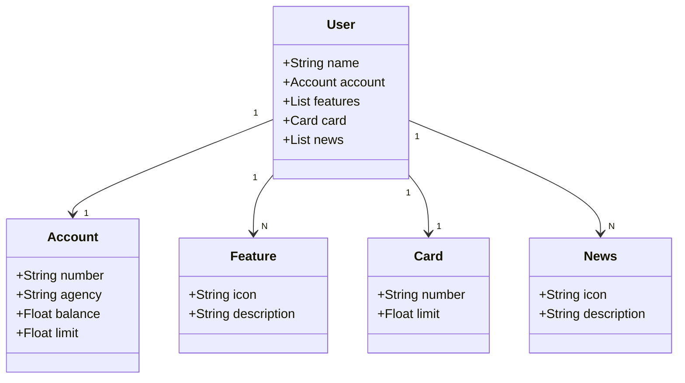

#Java API RESTful

## Diagrama de classes

```mermaid
classDiagram
    class User {
        +String name
        +Account account
        +List<Feature> features
        +Card card
        +List<News> news
    }

    class Account {
        +String number
        +String agency
        +Float balance
        +Float limit
    }

    class Feature {
        +String icon
        +String description
    }

    class Card {
        +String number
        +Float limit
    }

    class News {
        +String icon
        +String description
    }

    User "1" --> "1" Account
    User "1" --> "N" Feature
    User "1" --> "1" Card
    User "1" --> "N" News
```
